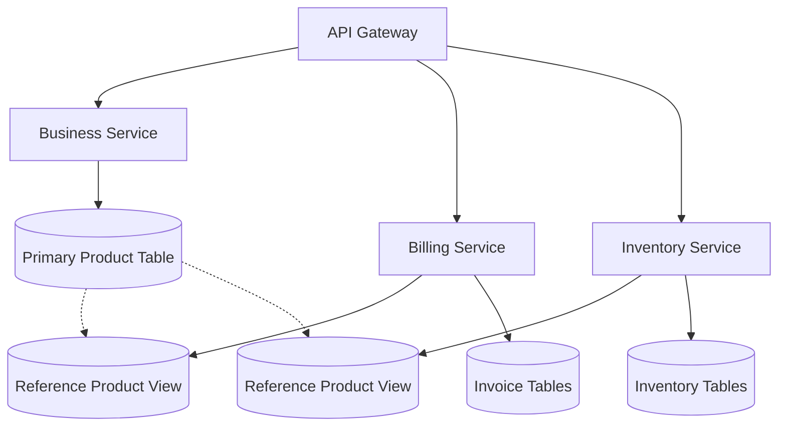

# Design Document: Add Product Description Field

## Overview

This design outlines the implementation of a description field for the product table across a multi-service Node.js application. The enhancement involves database schema changes, model updates across three services (business-service, billing-service, inventory-service), API modifications, and search functionality enhancement while maintaining full backward compatibility.

The implementation follows a coordinated approach where the business-service owns the primary product table, and the billing and inventory services maintain reference models that mirror the structure. The design ensures data consistency, maintains API backward compatibility, and extends search capabilities to include the new description field.

## Architecture

### Service Architecture
The application follows a microservices architecture with three main services:

1. **Business Service** (Primary Owner)
   - Owns the main product table
   - Provides primary CRUD operations for products
   - Handles product search functionality
   - Integrates with inventory service for stock information

2. **Billing Service** (Consumer)  
   - Maintains reference product model
   - Uses product data for invoice creation
   - Does not modify product data directly

3. **Inventory Service** (Consumer)
   - Maintains minimal product reference model
   - Tracks stock levels by product
   - References product data for reporting

### Data Flow


### Database Schema Changes

The description field will be added as:
- **Column Name:** `description`
- **Type:** `TEXT` (allows for long descriptions)
- **Nullable:** `YES` (maintains backward compatibility)
- **Default:** `NULL`

## Components and Interfaces

### 1. Database Migration Component

**Business Service Migration**
```sql
ALTER TABLE products 
ADD COLUMN description TEXT DEFAULT NULL;
```

**Migration Strategy:**
- Use TypeORM migration system
- Apply during low-traffic period
- No data loss or downtime
- Rollback capability included

### 2. Model Updates

**Business Service Product Model** (Primary)
```javascript
// Updated TypeORM EntitySchema
const Product = new EntitySchema({
  name: "Product",
  tableName: "products", 
  columns: {
    id: { primary: true, type: "int", generated: true },
    businessId: { type: "int" },
    productCode: { type: "varchar", unique: true },
    name: { type: "varchar" },
    category: { type: "varchar", nullable: true },
    price: { type: "decimal", precision: 10, scale: 2 },
    purchasePrice: { type: "decimal", precision: 10, scale: 2, nullable: true },
    uom: { type: "varchar" },
    gstRate: { type: "decimal", precision: 5, scale: 2 },
    description: { type: "text", nullable: true }  // NEW FIELD
  }
});
```

**Billing Service Reference Model**
```javascript
// Updated reference model (synchronize: false)
const Product = new EntitySchema({
  name: "Product",
  tableName: "products",
  synchronize: false,
  columns: {
    id: { primary: true, type: "int", generated: true },
    productCode: { type: "varchar", unique: true },
    name: { type: "varchar" },
    category: { type: "varchar", nullable: true },
    price: { type: "decimal", precision: 10, scale: 2 },
    purchasePrice: { type: "decimal", precision: 10, scale: 2, nullable: true },
    uom: { type: "varchar" },
    gstRate: { type: "decimal", precision: 5, scale: 2 },
    description: { type: "text", nullable: true }  // NEW FIELD
  }
});
```

**Inventory Service Reference Model**
```javascript
// Updated minimal reference model
const Product = new EntitySchema({
  name: "Product", 
  tableName: "products",
  synchronize: false,
  columns: {
    id: { primary: true, type: "int" },
    businessId: { type: "int" },
    productCode: { type: "varchar" },
    name: { type: "varchar" },
    uom: { type: "varchar", nullable: true },
    description: { type: "text", nullable: true }  // NEW FIELD
  }
});
```

### 3. API Controller Updates

**Business Service Product Controller**

*addProduct API Enhancement:*
```javascript
// Validation update - description is optional
const requiredFields = ['productCode', 'name', 'price', 'uom', 'gstRate'];
const optionalFields = ['category', 'purchasePrice', 'description'];

// Extraction logic  
const productData = {
  ...existingFields,
  description: item.description || null
};
```

*getProducts API Enhancement:*
```javascript
// Search functionality update
if (search) {
  query.andWhere(
    "(product.name ILIKE :search OR product.productCode ILIKE :search OR product.description ILIKE :search)",
    { search: `%${search}%` }
  );
}

// Response includes description field automatically via TypeORM
```

*updateProduct API Enhancement:*
```javascript  
// Allow description field in updates
const allowedFields = [
  'name', 'category', 'price', 'purchasePrice', 
  'uom', 'gstRate', 'description'  // NEW
];
```

### 4. Validation Component

**Input Validation Rules:**
- Description is optional (nullable)
- Maximum length: 5000 characters
- HTML/script tag sanitization
- Special character handling

**Validation Implementation:**
```javascript
const validateDescription = (description) => {
  if (!description) return null; // Allow null/undefined
  
  if (typeof description !== 'string') {
    throw new Error('Description must be a string');
  }
  
  if (description.length > 5000) {
    throw new Error('Description cannot exceed 5000 characters');
  }
  
  // Sanitize HTML/scripts
  return sanitizeInput(description);
};
```

### 5. Search Enhancement Component

**Updated Search Logic:**
```javascript
const buildSearchQuery = (queryBuilder, searchTerm) => {
  return queryBuilder.andWhere(
    "(product.name ILIKE :search OR product.productCode ILIKE :search OR COALESCE(product.description, '') ILIKE :search)",
    { search: `%${searchTerm}%` }
  );
};
```

**Search Performance Considerations:**
- Use COALESCE to handle NULL descriptions
- Consider indexing if search performance degrades
- Maintain existing query performance

## Data Models

### Updated Product Data Model

```typescript
interface Product {
  id: number;
  businessId: number;
  productCode: string;        // Unique identifier
  name: string;              // Display name
  category?: string;         // Product category (optional)
  price: number;            // Selling price
  purchasePrice?: number;   // Cost price (optional)
  uom: string;              // Unit of measurement
  gstRate: number;          // Tax rate
  description?: string;     // NEW: Product description (optional)
}
```

### API Request/Response Schemas

**Create Product Request:**
```json
{
  "productCode": "P001",
  "name": "Widget A", 
  "category": "Electronics",
  "price": 99.99,
  "purchasePrice": 75.00,
  "uom": "piece",
  "gstRate": 18.00,
  "description": "High-quality widget for industrial use"  // NEW OPTIONAL
}
```

**Product Response (includes inventory):**
```json
{
  "id": 1,
  "businessId": 123,
  "productCode": "P001",
  "name": "Widget A",
  "category": "Electronics", 
  "price": 99.99,
  "purchasePrice": 75.00,
  "uom": "piece",
  "gstRate": 18.00,
  "description": "High-quality widget for industrial use",  // NEW FIELD
  "currentStock": 50,
  "lowStock": false
}
```

### Inter-Service Data Transfer

**Product Data in Invoice Items:**
```json
{
  "productId": 1,
  "productName": "Widget A",
  "price": 99.99,
  "qty": 2,
  "discount": 0,
  "gstRate": 18.00,
  "total": 235.96,
  "description": "High-quality widget for industrial use"  // NEW
}
```

## Correctness Properties

*A property is a characteristic or behavior that should hold true across all valid executions of a system—essentially, a formal statement about what the system should do. Properties serve as the bridge between human-readable specifications and machine-verifiable correctness guarantees.*

### Property 1: Description Field Persistence

*For any* product with a description value, storing and then retrieving the product should return the same description value unchanged.

**Validates: Requirements 3.1, 3.3**

### Property 2: API Response Completeness  

*For any* product query or retrieval operation, the response should always include the description field, whether the value is null or contains data.

**Validates: Requirements 2.4, 3.2**

### Property 3: Backward Compatibility Preservation

*For any* valid product API request that was accepted before the description field addition, the same request should continue to be accepted and processed successfully after the enhancement.

**Validates: Requirements 3.4, 7.1, 7.2, 7.3**

### Property 4: Search Inclusion Behavior

*For any* search query that matches content within a product's description field, that product should be included in the search results.

**Validates: Requirements 4.1, 4.3**

### Property 5: Case-Insensitive Search Consistency

*For any* search term, the search results should be identical regardless of the case (upper, lower, mixed) of the search term when matching against name, productCode, or description fields.

**Validates: Requirements 4.2**

### Property 6: Validation Boundary Enforcement

*For any* description input within the defined length limit, the system should accept it, and for any description exceeding the limit, the system should reject it with a clear error message.

**Validates: Requirements 5.1, 5.2**

### Property 7: Input Sanitization Safety

*For any* description input containing potentially harmful content, the stored and retrieved description should be sanitized and safe, preventing injection attacks while preserving legitimate content.

**Validates: Requirements 5.3, 5.4**

### Property 8: Inter-Service Data Consistency

*For any* product used across services (business, billing, inventory), the description field should be consistently available and contain the same value in all service contexts.

**Validates: Requirements 6.1, 6.2, 6.3, 6.4**

### Property 9: Null Handling Gracefully  

*For any* operation where the description field is not provided or is null, the system should handle it gracefully without errors and set the field to null in storage.

**Validates: Requirements 3.5, 7.3**

### Property 10: Response Format Stability

*For any* API response that was valid before the description field addition, the response structure should remain compatible with existing consumers while including the new description field.

**Validates: Requirements 7.4, 7.5**

## Error Handling

### Database Migration Errors
- **Migration Failure Recovery**: If migration fails, rollback mechanism ensures data integrity
- **Connection Loss During Migration**: Transaction-based migration with automatic rollback
- **Insufficient Permissions**: Clear error messages for database permission issues

### API Input Validation Errors
```javascript
// Description validation error responses
{
  "status": "error",
  "statusMessage": "Description exceeds maximum length",
  "displayMessage": "Product description cannot exceed 5000 characters",
  "field": "description"
}

{
  "status": "error", 
  "statusMessage": "Invalid description content",
  "displayMessage": "Product description contains invalid characters",
  "field": "description"
}
```

### Service Communication Errors
- **Inter-Service Timeout**: Graceful degradation if services are unavailable
- **Data Synchronization Issues**: Retry mechanisms for cross-service updates
- **Partial Service Failures**: Continue operations with logging for manual intervention

### Search Performance Degradation
- **Large Description Search**: Implement query optimization if performance issues arise
- **Index Requirements**: Monitor and add database indexes if search becomes slow
- **Fallback Mechanisms**: Default to name/productCode search if description search fails

## Testing Strategy

### Property-Based Testing Approach

The feature implementation uses property-based testing to verify universal correctness properties across a wide range of inputs. Each correctness property will be implemented as a separate property-based test with minimum 100 iterations to ensure comprehensive coverage.

**Property Test Configuration:**
- Test Framework: fast-check (JavaScript property-based testing library)
- Minimum Iterations: 100 per property test  
- Test Environment: Isolated test database with clean state per test
- Data Generators: Custom generators for products, descriptions, and search terms

**Property Test Implementation:**
- Each property test references its corresponding design document property
- Tag format: **Feature: add-product-description-field, Property {number}: {property_text}**
- Tests cover edge cases: empty strings, null values, maximum length, special characters
- Database state verification after each property test execution

### Unit Testing Complementary Coverage

**Specific Examples and Edge Cases:**
- Empty description handling
- Maximum length boundary testing (4999, 5000, 5001 characters)
- Special character preservation (Unicode, emojis, newlines)
- SQL injection prevention verification
- Null vs empty string distinction

**Integration Testing:**
- Database migration execution and rollback
- Cross-service communication validation
- API endpoint integration with various clients
- Search functionality with database indexes

**Smoke Tests:**
- Database schema verification post-migration
- Model configuration validation across services  
- Basic CRUD operations with description field
- Service startup with new schema

### Testing Implementation Notes

**Property Test Examples:**
```javascript
// Property 1: Description Field Persistence
test('Feature: add-product-description-field, Property 1: Description persistence', 
  fc.asyncProperty(
    productGenerator(), 
    descriptionGenerator(),
    async (product, description) => {
      const created = await addProduct({...product, description});
      const retrieved = await getProduct(created.id);
      expect(retrieved.description).toBe(description);
    }
  ), 
  { numRuns: 100 }
);
```

**Mock Strategy:**
- Mock inter-service calls for isolated testing
- Use test database containers for integration tests
- Mock external dependencies while testing core logic

**Performance Testing:**
- Search performance benchmarks before and after implementation
- Database query optimization validation
- API response time consistency verification

### Test Data Management

**Generator Configuration:**
- Product data: Valid business scenarios with realistic field combinations
- Description content: Various lengths, character sets, and formats
- Search terms: Partial matches, exact matches, case variations, special characters
- Edge cases: Boundary values, null handling, malformed input

**Test Database Strategy:**
- Isolated test database per test suite
- Migration testing on database copies
- Data cleanup between test runs
- Performance test data sets for realistic load testing
